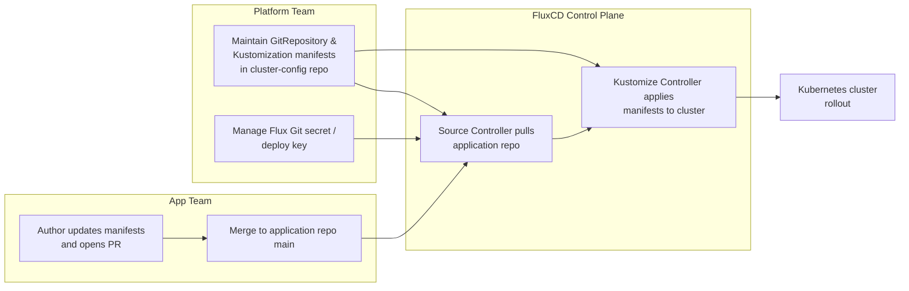

# openCenter-customer-app-example

This repository provides a reference customer application deployment for the openCenter platform using Kustomize overlays and optional Flux Helm integration. It is designed for multi-team environments where each team manages its own GitOps configuration in a shared FluxCD control plane.

## Repository Structure
- `kustomization.yaml` — Root composition that assembles shared gateway resources and application manifests.
- `gateway-resources/` — Gateway API definitions reused by all apps (Gateway, listeners, host rules).
- `app1/` — Baseline customer workload built with raw Kubernetes manifests (Deployment, Service, cert issuers).
- `app2/` — Optional Helm-based workload powered by a `HelmRelease` plus bundled values in `helm-values/`.
- `docs/fluxcd-deployment.md` — Extended instructions for integrating with FluxCD.

## FluxCD Integration (Existing Environment)
Use the following process when the platform Flux controllers are already running and teams self-manage their applications:

### Application team
1. **Clone or create new repo**
   ```bash
   git clone https://github.com/<org>/openCenter-customer-app-example
   ```
2. **Modify repo as needed**
   Update manifests in this repository (for example adjust listeners in `gateway-resources/gateway.yaml`) to reflect the application’s requirements.
3. **Add the deploy key** supplied by the platform team so Flux can authenticate to the repository.
4. **Optional Helm components**: uncomment the `app2/` entry in this repo’s `kustomization.yaml`, open a PR, and merge once reviewers sign off. Flux will render the HelmRelease using the values in `app2/helm-values/` during the next reconciliation cycle.

### Platform team
1. **Create a Git source manifest** in your cluster configuration repository (e.g., `clusters/<cluster>/customer-managed/<app>/customer-app-source.yaml`):
   ```yaml
   apiVersion: source.toolkit.fluxcd.io/v1
   kind: GitRepository
   metadata:
     name: customer-app
     namespace: flux-system
   spec:
     interval: 1m
     url: https://github.com/<org>/openCenter-customer-app-example
     ref:
       branch: main
   ```
2. **Create a Kustomization manifest** in the same directory to reconcile this repo:
   ```yaml
   apiVersion: kustomize.toolkit.fluxcd.io/v1
   kind: Kustomization
   metadata:
     name: customer-app
     namespace: flux-system
   spec:
     interval: 10m
     prune: true
     wait: true
     path: ./
     sourceRef:
       kind: GitRepository
       name: customer-app
   ```
3. **Commit and push** these manifests to the shared cluster config repository. Flux will detect the update and roll out the resources automatically.
4. **Create a Flux Git secret** to authorize access to the application repository:
   ```bash
   flux create secret git opencenter-customer-app-example \
     --ssh-key-algorithm=ed25519 \
     --url=ssh://git@github.com/rackerlabs/openCenter-customer-app-example.git \
     -n flux-system
   ```
   Distribute the generated public key to the application team so they can add it as a deploy key.

## Collaboration Flow


## Validation & Operations
- Run `kustomize build .` locally (add `--enable-helm` if `app2` is enabled) before pushing changes.
- Use `kubeconform <(kustomize build .)` to validate manifests against Kubernetes schemas.
- Execute `pre-commit run --all-files` to trigger the repository Yamllint hook prior to opening a pull request.
- Force a refresh after merging changes with `flux reconcile kustomization customer-app --with-source`.
- Track status across teams by labeling Kustomization manifests with ownership metadata (e.g., `toolkit.fluxcd.io/team: acme`).

## Secret & Configuration Management
Do not commit raw secrets. Reference secrets provisioned by the platform team or integrate with secret controllers such as External Secrets Operator or Sealed Secrets. Update manifest references (`spec.secretName`, `valuesFrom`) to match the secrets managed in your cluster.

## Troubleshooting Tips
- Inspect controller logs via `kubectl logs -n flux-system deploy/kustomize-controller -f` when reconciliations fail.
- Use `flux diff kustomization customer-app --path=./` to check changes locally before committing.
- Coordinate shared gateway modifications with other teams to avoid conflicting host rules in `gateway-resources/`.

## Local Tooling
- Install the pre-commit framework (`pip install pre-commit` or `brew install pre-commit`).
- Run `pre-commit install` once to register the hook; subsequent commits will run `yamllint --strict` using the repo’s `.yamllint` policy.
- Execute `pre-commit run --all-files` before opening a PR to lint every YAML manifest.
